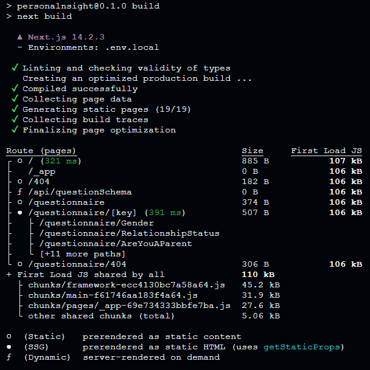

<p align="center" border="50%" background="white" padding="15">
	
</p>

## Launching the questionnaire

### 1. Cloning the repository: 
The first step is to clone the project repository to your computer. You can do this with a command:
```shell
https://github.com/LooLoo1/personalnsight.git
```

### 2. Install dependencies:
After cloning the repository, navigate to its root folder and install all necessary dependencies using the command:
```
npm install
```

### 3. Starting a project
#### 3.1 Run the project in development mode: 
```
npm run dev
```
#### 3.2 Open a browser and go to [http://localhost:3000](http://localhost:3000).
#### 3.3 To run in production mode:
```
npm run build && npm run start
```

### 4. Production build
<p align="center">

</p>

### 5. Flexible approach to question structure:
I have developed a flexible approach to question structure that allows for a variable graph structure. This means that the order of the questions and the logic of the transition between them can be customized depending on the user's answers. Question headings are automatically generated based on previous answers, making the questionnaire more dynamic and personalized.

```ts
export type Choice = {
  id?: number;
  text: string;
  nextQuestionId: number;
  value: string | number | boolean;
  template?: string;
  responseKey?: string;
};

export type Question = {
  id: number;
  title: string;
  description?: string;
  type: "question";
  defaultNext: number;
  choices: Choice[];
  responseKey: string;
};

export type QuestionNow = {
  id: number;
  type: "question" | "alert";
};

export type Button = {
  type: "Button";
  text: string;
  nextQuestionId?: number;
  link?: string;
};

export type Element = {
  type: "Title" | "Description";
  text: string;
};

export type AlertStructure = (Element | Button)[];

export type Alert = {
  id: number;
  type: "alert";
  defaultNext?: number;
  structure: AlertStructure;
};

export type QuestionsSchema = Question | Alert;
```
### 6. Modular project architecture:
I chose a simple modular architecture for this project to make it more flexible and extensible. This means that the different parts of the project (questions, transition logic, response storage) are divided into separate modules, which makes it easier to modify them and add new features.

### 7. Simulation of asynchronous requests:
Since this is a test case, I did not write a back-end for the project. Instead, I simulated asynchronous requests using procs. This allows me to test the logic of the questionnaire without having a real server.

---

## Requirements:

### Front-end:
- Using Next.js to create pages.
- Pages should be responsive to mobile and desktop devices (no need to adapt to tablets).
- The number of pages should correspond to the number of screens with questions.
- Pages are generated using Next.js getStaticPaths.
- Storing user responses in the state manager.
- The questionnaire configuration (questions, answers, transition logic) should be stored in a separate JSON or TS file.
- The configuration should be extensible: the ability to add/change question types, number of answer options, etc.
### Technologies:
- TypeScript
- Next.js
- Redux or other state manager
- ESLint
- Prettier
### General requirements:
- The repository with the project must be public on GitHub/GitLab/Bitbucket.
- Launch the project using the npm build && npm start command.
- Availability of README.md file with launch instructions for dev and production environments.

